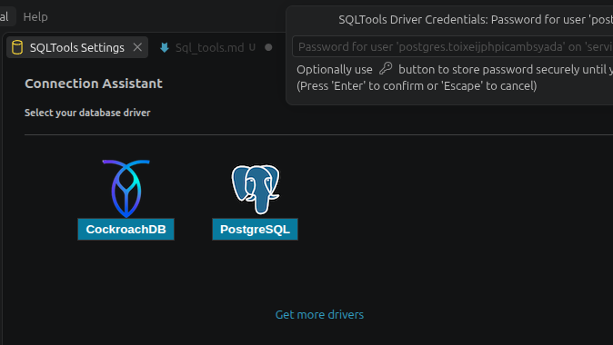
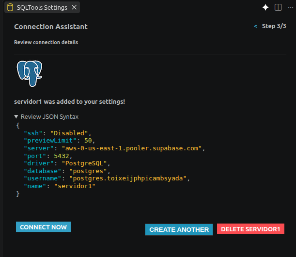

# Guía: Conectar Supabase a SQLTools (VS Code)

Esta guía documenta el proceso y la explicación de los campos para agregar una conexión de **Supabase** en **SQLTools** dentro de Visual Studio Code.

---

## 1. Proceso de Conexión

1. Abre Visual Studio Code.
2. Ve a la extensión **SQLTools** en la barra lateral izquierda e instala.

3. Haz clic en **Add New Connection** y selecciona el driver de **PostgreSQL**.
4. Completa los campos del asistente con la información de tu proyecto de Supabase.
5. Introduce la contraseña cuando la alerta flotante de *SQLTools Driver Credentials* la solicite.
6. Haz clic en **Test Connection** y, tras confirmar el éxito, selecciona **Save Connection**.

---

## 2. Explicación de los Campos Requeridos

### **Credenciales Principales (`Connection Settings`)**

- **Connection name\***: Un nombre identificador para la conexión (ej. `Supabase - Proyecto`).
- **Connection group**: *(Opcional)* Para agrupar diferentes conexiones en la interfaz.
- **Connect using\***: Mantener en `Server and Port`.
- **Server Address\***: El Host de tu base de datos de Supabase (ej. `db.xxxxxx.supabase.co` o el host del pooler `aws-0-xxxx.pooler.supabase.com`). Reemplaza `localhost`.
- **Port\***: `5432` para conexión directa o `6543` si utilizas el Connection Pooler.
- **Database\***: `postgres` (nombre por defecto de la base de datos en Supabase).
- **Username\***: `postgres` (o `postgres.tu_project_ref` si utilizas el modo Pooler).
- **Use password**: Seleccionar `SQLTools Driver Credentials` para que pida la contraseña al conectar y la almacene de forma segura.

---

## 3. al agregar los campos y culminar el llenado del formulario y los puertos 

