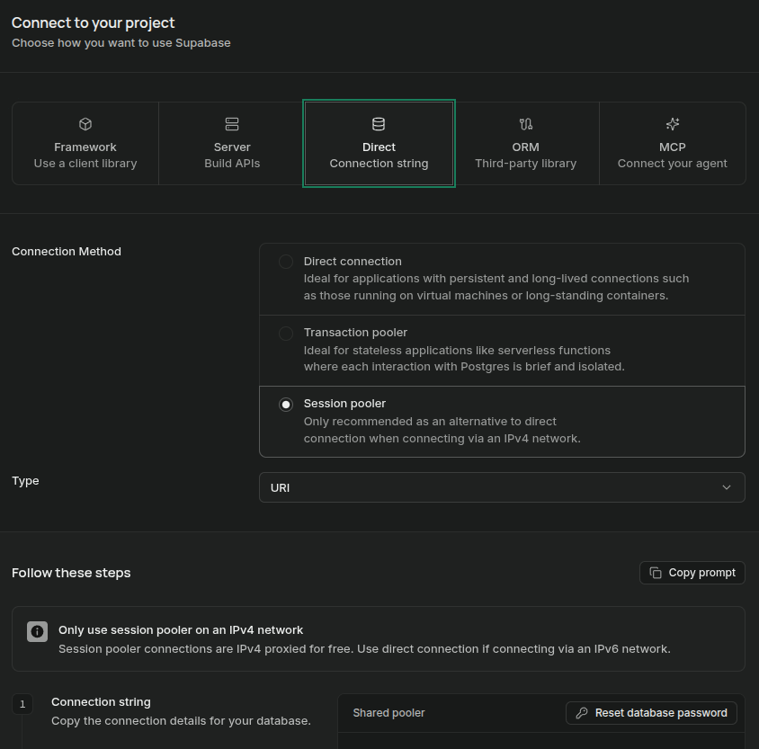

# Bitácora de Desarrollo — Registro Diario

## 📝 Resumen del Día
Hoy se trabajó en la configuración y conexión de la base de datos PostgreSQL, tanto en entorno local mediante ejecución SQL, como en la nube integrando la instancia de Supabase.

---

## 🛠️ Configuración de Base de Datos y Supabase

### 1. Variables de Entorno (`.env`)
Para conectar la aplicación con PostgreSQL y la instancia en la nube de Supabase, se debe configurar la variable de entorno `DATABASE_URL` en un archivo `.env` en la raíz del proyecto:

```env
# Estructura general de la cadena de conexión
DATABASE_URL=postgresql://<usuario>:<contraseña>@<host>:<puerto>/<nombre_bd>

# Ejemplo para la instancia en la nube (Supabase Transaction / Session Pooler)
DATABASE_URL=postgresql://postgres.<project-id>:<password>@[aws-0-sa-east-1.pooler.supabase.com:6543/postgres](https://aws-0-sa-east-1.pooler.supabase.com:6543/postgres)
```
aqui copiamos nuestros parametros
<p align="center">
  
</p>

> ⚠️ **Nota de seguridad:** Nunca subas el archivo `.env` con las credenciales reales a GitHub. Asegúrate de incluir `.env` en tu `.gitignore`.


## ☁️ Integración con Supabase (Nube)
* **Hosting de BD:** La instancia principal de la base de datos se encuentra alojada en la nube mediante **Supabase**.
* **Gestión:** Se gestionan las tablas, políticas de acceso y credenciales de conexión directamente desde el Panel de Control de Supabase.
* **Conexión Directa:** Toda interacción desde el código backend se realiza utilizando la cadena de conexión administrada en las variables de entorno.

<p align="center">
  
</p>
en el proyecto de segundo trimestre usamos el framework de supabase