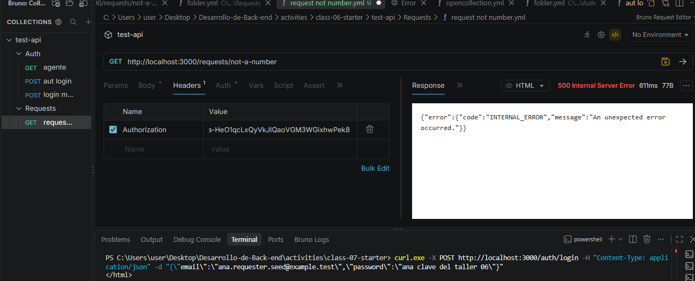

# Class 07 incident report

Completa cada sección MIENTRAS investigas. Separa hechos de
interpretaciones: un "creo que" pertenece a Hypotheses, no a Evidence.

## Baseline

Which command confirmed the starting state?
npm run class-07:doctor  # 7/7 PASS
npm test                 # 20 pass, 17 todo

## Incident 701

### Report
Soporte reporta que algunas solicitudes devuelven 500 cuando se consultan con identificadores que no son números.

### Reproduction
- Method: GET
- Path: /requests/not-a-number
- User: Ana (requester)
- Headers: Authorization: Bearer <token válido>

### Expected result
400 Bad Request
```json
{
  "error": {
    "code": "INVALID_REQUEST_ID",
    "message": "Request id must be a positive integer."
  }
}
```

### Actual result
500 Internal Server Error
```json
{
  "error": {
    "code": "INTERNAL_ERROR",
    "message": "An unexpected error occurred."
  }
}
```

### Hypotheses
1. **El ID no se valida antes de llegar a SQL** (probable)
   - Cómo verificar: Buscar en requests.routes.js si hay validación de Number() antes de findById()

2. **PostgreSQL lanza error y no se atrapa como AppError** (posible)
   - Cómo verificar: Revisar si el error de PostgreSQL viaja sin ser transformado en respuesta HTTP

3. **El middleware de errores no está registrado** (menos probable)
   - Cómo verificar: Revisar app.js si errorHandler está después de las rutas

### Evidence
- En requests.routes.js:30: `Number(req.params.id)` convierte "not-a-number" a NaN
- En requests.store.js:51: `WHERE id = $1` recibe NaN
- El error en terminal dice: "invalid input syntax for type integer"
- No hay validación del ID antes de llegar a SQL
- La respuesta 500 confirma que el error no es un AppError con categoría "contract"



### Confirmed cause
El parámetro `:id` de la URL no se valida antes de pasarse a la base de datos. `Number("not-a-number")` devuelve `NaN`, que se envía a SQL, causando un error de PostgreSQL que no es transformado en AppError, sino que viaja como error genérico 500. La corrección es validar el ID en el router antes de llamar a `findById()`.

### Correction
- **Archivo:** `src/modules/requests/requests.routes.js`
- **Cambio:** Agregar validación del ID antes de llamar a `getRequest()`:
  ```javascript
  const id = Number(req.params.id);
  if (isNaN(id) || id <= 0 || !Number.isInteger(id)) {
    throw new AppError('contract', 'INVALID_REQUEST_ID', 
      'Request id must be a positive integer.');
  }
  ```
  Esto convierte un error 500 en un error 400 con código `INVALID_REQUEST_ID` antes de que el ID llegue a PostgreSQL.

### Regression test
- `GET /requests/not-a-number` → `400 INVALID_REQUEST_ID` ✓
- `GET /requests/0` → `400 INVALID_REQUEST_ID` ✓
- `GET /requests/999999999` → `404 REQUEST_NOT_FOUND` ✓
- `GET /requests/123` (existente) → `200 OK` ✓

## Incident 702

### Report

### Reproduction

### Expected result

### Actual result

### Hypotheses

### Evidence

### Confirmed cause

### Correction

### Regression test

## Error flow

Where is the error created?
How does it reach the error middleware?
What is returned to the client?
What remains only in the server log?

## Request ID

How did I prove that the response and log belong to the same request?

## AI assistance

What did AI help me understand?
Which hypothesis did it propose?
How did I verify it?
What suggestion was incomplete or incorrect?

## Remaining doubt

What part do I still not understand?
