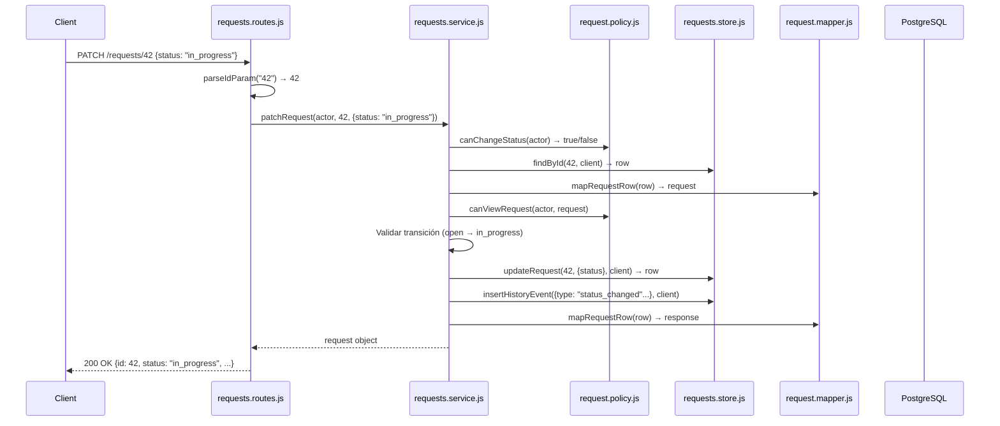
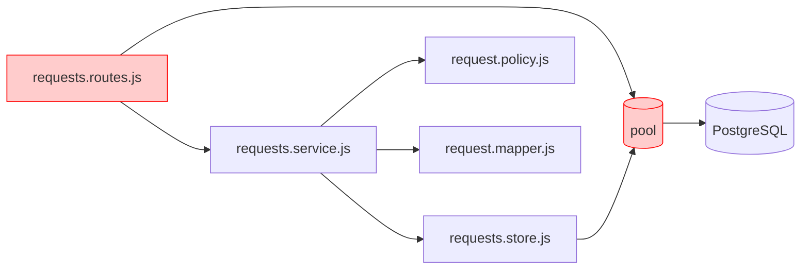
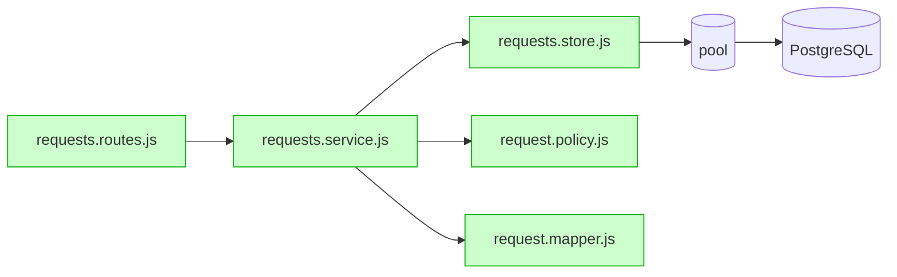

# Módulo Requests — Arquitectura y Refactor Clase 8

## Visión general

Este módulo implementa la API de solicitudes siguiendo **arquitectura en capas** con **flechas en una dirección**:

```
HTTP (routes) → Caso de uso (service) → Datos (store) → PostgreSQL
                    ↓
              Policy (reglas puras)
                    ↓
              Mapper (serialización)
```

**Principio rector**: *Un archivo cambia por una sola razón.* Si necesitas "y también" para describirlo, hay acoplamiento.

---

## Estructura de archivos

| Archivo | Responsabilidad | Cambia cuando... | Dependencias |
|---------|-----------------|------------------|--------------|
| `requests.routes.js` | Capa HTTP: params, query, body, status codes | Nuevo endpoint, contrato HTTP | `requests.service.js`, `parseIdParam` |
| `requests.service.js` | Orquesta caso de uso: policy + store + mapper + transacciones | Nueva regla de negocio, flujo | `store`, `policy`, `mapper`, `request-status`, `transaction` |
| `request.policy.js` | **Funciones puras** de autorización (sin I/O) | Cambian permisos/roles | **Ninguna** (hoja) |
| `requests.store.js` | SQL parametrizado, transacciones, scopes en BD | Cambia esquema, índices, queries | `pool` (solo implementación) |
| `request.mapper.js` | snake_case (BD) → camelCase (HTTP) | Cambia JSON público | **Ninguna** (hoja) |
| `request-status.js` | Máquina de estados + transiciones válidas | Cambia lifecycle | **Ninguna** (hoja) |

---

## Flujo de una petición (ejemplo: `PATCH /:id`)



---

## 🚨 Violación conocida: `GET /:id/history` (líneas 38-97 de routes.js)

### Qué hace hoy (TODO en el handler)

```mermaid
flowchart TD
    A[routes.js: GET /:id/history] --> B[Validar id HTTP]
    A --> C[pool.query SELECT requests]
    A --> D[Policy inline: role + owner check]
    A --> E[pool.query SELECT request_history]
    A --> F[Mapping inline duplicado]
    A --> G[res.status(200).json]
```

### Responsabilidades mezcladas

| Responsabilidad | Código actual | Debería estar en |
|-----------------|---------------|------------------|
| Validar `id` HTTP | L39-45 | routes ✅ |
| **SQL: buscar request** | L48-56 | **store.findById** ❌ |
| **Policy: visibilidad** | L58-64 | **policy.canViewHistory** ❌ |
| **SQL: buscar history** | L67-73 | **store.findHistory** ❌ |
| **Mapping JSON** | L76-93 | **mapper.mapHistoryEventRow** ❌ (duplicado) |
| Responder 200 | L96 | routes ✅ |

### Por qué rompe la arquitectura

1. **Importa `pool` directamente** (L9) → capa HTTP conoce BD
2. **Duplica mapping** → mismo código que `mapper.mapHistoryEventRow`
3. **Reescribe policy a mano** → misma lógica que `policy.canViewHistory`
4. **4+ razones de cambio** → HTTP, SQL, policy, mapping

---

## Snippet ANTES: Handler actual en routes.js (líneas 38-97)

```javascript
// ─────────────────────────────────────────────────────────────────────
// GET /:id/history — the handler that does EVERYTHING.
// HTTP, visibility rules, SQL, mapping and response, all in one place.
// ─────────────────────────────────────────────────────────────────────
router.get('/:id/history', async (req, res) => {
  // Reading and validating the path parameter (HTTP).
  const raw = req.params.id;
  if (typeof raw !== 'string' || !/^[1-9][0-9]{0,17}$/.test(raw)) {
    throw new AppError('contract', 'INVALID_REQUEST_ID',
      'Request id must be a positive integer.');
  }
  const id = Number(raw);

  // Fetching the request (SQL, in the middle of a route).
  const requestResult = await pool.query(
    `SELECT id, title, description, priority, status, created_by, created_at, updated_at
     FROM requests WHERE id = $1`,
    [id]
  );
  const requestRow = requestResult.rows[0];
  if (!requestRow) {
    throw new AppError('resource', 'REQUEST_NOT_FOUND', `Request ${id} does not exist.`);
  }

  // Deciding visibility (a business rule, re-written here by hand).
  const isAgent = req.auth.role === 'agent';
  const isOwner = requestRow.created_by === req.auth.userId;
  if (!isAgent && !isOwner) {
    throw new AppError('resource', 'REQUEST_NOT_FOUND', `Request ${id} does not exist.`);
  }

  // Fetching the history (more SQL).
  const historyResult = await pool.query(
    `SELECT id, type, from_status, to_status, from_priority, to_priority, created_at
     FROM request_history
     WHERE request_id = $1
     ORDER BY created_at, id`,
    [id]
  );

  // Building the representation (mapping, duplicated from the mapper).
  const events = historyResult.rows.map((row) => {
    if (row.type === 'priority_changed') {
      return {
        id: Number(row.id),
        type: row.type,
        fromPriority: row.from_priority,
        toPriority: row.to_priority,
        createdAt: row.created_at
      };
    }
    return {
      id: Number(row.id),
      type: row.type,
      fromStatus: row.from_status,
      toStatus: row.to_status,
      createdAt: row.created_at
    };
  });

  // Answering (HTTP again).
  res.status(200).json(events);
});
```

---

## Snippet DESPUÉS: Refactor objetivo

### 1. `requests.service.js` — Nueva función `getHistory`

```javascript
// Agregar al final de requests.service.js
import { findHistory } from './requests.store.js';
import { canViewHistory } from './request.policy.js';
import { mapHistoryEventRow } from './request.mapper.js';

export async function getHistory(actor, id) {
  const requestRow = await findById(id);
  if (!requestRow) throw notFound(id);

  const request = mapRequestRow(requestRow);
  if (!canViewHistory(actor, request)) throw notFound(id);

  const historyRows = await findHistory(id);
  return historyRows.map(mapHistoryEventRow);
}
```

### 2. `requests.routes.js` — Handler limpio

```javascript
// Eliminar: import { pool } from '../../database/pool.js';
// Eliminar: import { AppError } from '../../app-error.js';
// Agregar: import { getHistory } from './requests.service.js';

router.get('/:id/history', async (req, res) => {
  const id = parseIdParam(req.params.id);
  const events = await getHistory(req.auth, id);
  res.status(200).json(events);
});
```

### 3. Archivos que YA tienen lo necesario (no tocar)

| Archivo | Función existente | Lista |
|---------|-------------------|-------|
| `requests.store.js` | `findHistory(requestId, db?)` | L105-116 |
| `request.policy.js` | `canViewHistory(actor, request)` | L25-27 |
| `request.mapper.js` | `mapHistoryEventRow(row)` | L18-36 |

---

## Grafo de dependencias: ANTES vs DESPUÉS

### ANTES (con violación)



### DESPUÉS (arquitectura limpia)



---

## Checklist post-refactor

- [ ] `routes.js` **no importa** `pool` ni `AppError`
- [ ] `service.js` **no conoce** `express`, `req`, `res`
- [ ] `policy.js` sigue **sin deps salientes**
- [ ] `GET /:id/history` en routes < 15 líneas
- [ ] Tests `class-06` y `class-07` pasan sin cambios
- [ ] `request-status.js` sin tocar (reglas de dominio intactas)

---

## Referencias por clase

| Clase | Concepto | Archivo(s) |
|-------|----------|------------|
| 03 | Estados y transiciones | `request-status.js` |
| 04 | SQL, migraciones, pool | `requests.store.js` |
| 05 | AuthZ, policy | `request.policy.js` |
| 06 | Onboarding, tests, mapper | `request.mapper.js` |
| 07 | Diagnóstico, INC-701 | `parse-id.js` (validación ID) |
| 08 | Refactor `GET /:id/history` | **Este documento** |

---

## Nota de estudio

> La arquitectura no se logra creando archivos, se logra **agrupando por razón de cambio**.
>
> - `policy.js` no tiene flechas de salida → se prueba en milisegundos sin mocks
> - `store.js` solo conoce SQL → cambiar esquema no rompe HTTP
> - `routes.js` solo conoce HTTP → cambiar status code no toca SQL
>
> **Un módulo se entiende cuando puedes leer sus flechas sin encontrar ciclos.**

---

# Guía práctica: Las 3 tarjetas para refactor seguro

> **Sin red no hay refactor — hay apuestas**
> "La suite verde convierte 'creo que no rompí nada' en 'demuestro que no rompí nada'."

Tu red, hoy: **39 pruebas verdes del baseline** — describen el comportamiento actual, cubren rutas, status, bodies, permisos. Si una se pone roja durante el refactor: cambiaste comportamiento — deshaz el paso.

---

## 🟦 Tarjeta 1: CLASIFICAR — "Pon etiquetas a cada cosa"

> Aquí va un handler. Clasifica cada bloque en:
> HTTP / aplicación / negocio / persistencia / presentación / observabilidad.
> **NO propongas refactor todavía: solo el mapa.**

### Aplicación al handler `GET /:id/history` (routes.js L38-97)

| Bloque de código | Etiqueta |
|------------------|----------|
| `req.params.id`, `parseIdParam`, `res.status(200).json()` | 🌐 **HTTP** (entrada/salida) |
| `pool.query SELECT...` | 💾 **Persistencia** (SQL) |
| `req.auth.role === 'agent'`, `created_by === req.auth.userId` | 🏢 **Negocio** (reglas/permisos) |
| `.map(row => { id: Number(row.id), fromStatus... })` | 🎨 **Presentación** (JSON público) |
| `throw new AppError(...)` | 🌐 **HTTP** (respuesta error) |
| *(no hay logs/métricas)* | 📊 **Observabilidad** — *ausente* |

**Regla de oro:** *Solo miras y pones etiquetas. NO mueves nada.*

---

## 🟨 Tarjeta 2: DETECTAR ACOPLAMIENTO — "¿Qué sabe este archivo que NO debería saber?"

> ¿Qué sabe este archivo que no le corresponde?
> Lista cada detalle ajeno (columnas, status, req/res) y di a qué capa pertenece.
> **No reescribas nada.**

### En `routes.js` (handler history)

| Detalle ajeno que sabe `routes.js` | Capa a la que pertenece | Por qué es problema |
|-----------------------------------|------------------------|---------------------|
| `pool` (conexión BD) | Persistencia | HTTP no debe conocer BD |
| Nombres de tablas: `requests`, `request_history` | Persistencia | Cambio de esquema rompe HTTP |
| Columnas: `created_by`, `from_status`, `to_priority` | Persistencia | Detalle de implementación |
| Lógica `isAgent \|\| isOwner` | Negocio | Policy duplicada a mano |
| Mapeo `row.from_priority → fromPriority` | Presentación | Duplicado de `mapper.js` |

**Regla de oro:** *Lista lo ajeno. NO reescribas.*

---

## 🟩 Tarjeta 3: PLANIFICAR PASOS — "Pasitos de bebé, uno a la vez"

> Propón un plan de refactor en pasos PEQUEÑOS y REVERSIBLES.
> Después de cada paso la suite debe seguir verde.
> **Prohibido:** cambiar rutas, status, bodies o permisos.

### Plan para `GET /:id/history` (8 pasos, siempre igual)

| Paso | Acción | Archivo | Verificación |
|------|--------|---------|--------------|
| 0 | `npm test` → 39 verdes | — | **Si no verde: PARAR** |
| 1 | Crear `getHistory(actor, id)` en service | `service.js` | Usa SOLO funciones existentes |
| 2 | `npm test` → 39 verdes | — | Si roja: `git checkout service.js` |
| 3 | Cambiar handler en routes a 3 líneas | `routes.js` | Llama a `service.getHistory` |
| 4 | Borrar `import { pool }` y `AppError` | `routes.js` | Ya no se usan |
| 5 | `npm test` → 39 verdes | — | Si roja: deshacer paso 3-4 |
| 6 | Commit + anotar en `refactor-log.md` | — | Histórico |

**Regla de oro:** *Un paso = un archivo tocado = tests verdes. Si tests rojos → deshaces ESE paso.*

---

## La ruta (mapa) para llegar al refactor limpio

```
INICIO
  │
  ▼
┌─────────────────────────────────────┐
│ 0. VERDE ANTES (npm test = 39 pass) │  ← Puerta de entrada
└─────────────────────────────────────┘
  │
  ▼
┌─────────────────────────────────────┐
│ 1. CLASIFICAR handler history       │  ← Gafas azules
│    (HTTP / Negocio / BD / JSON)     │
└─────────────────────────────────────┘
  │
  ▼
┌─────────────────────────────────────┐
│ 2. DETECTAR acoplamiento en routes  │  ← Gafas amarillas
│    (pool, columnas, policy, mapper) │
└─────────────────────────────────────┘
  │
  ▼
┌─────────────────────────────────────┐
│ 3. PLANIFICAR 6 pasos pequeños      │  ← Gafas verdes
│    (service → route → limpiar)      │
└─────────────────────────────────────┘
  │
  ▼
┌─────────────────────────────────────┐
│ 4. EJECUTAR paso a paso             │  ← Camina
│    test → verde → siguiente         │
└─────────────────────────────────────┘
  │
  ▼
FIN: routes delgado, service orquesta, tests verdes
```

---

## Checklist mental diario

**Antes de escribir CUALQUIER código:**
- [ ] ¿Ya pasé tarjeta 1 (Clasificar)?
- [ ] ¿Ya pasé tarjeta 2 (Detectar acoplamiento)?
- [ ] ¿Tengo plan por escrito de tarjeta 3 (pasos pequeños)?

**Mientras escribo:**
- [ ] ¿La IA me dio código sin que pidiera? → **VUELVE A TARJETA**
- [ ] ¿Tests se pusieron rojos? → **DESHACE ÚLTIMO PASO**

**Al terminar:**
- [ ] ¿Routes delgado? (solo HTTP)
- [ ] ¿Service orquesta sin conocer req/res?
- [ ] ¿Policy/store/mapper intactos?
- [ ] ¿39 tests verdes?

---

## Próxima acción concreta (para hoy)

1. **Paso 0**: `npm test` → confirma 39 verdes
2. **Paso 1**: Añade `getHistory(actor, id)` a `service.js` (solo conecta lo que ya existe: `findById`, `canViewHistory`, `findHistory`, `mapRequestRow`, `mapHistoryEventRow`)
3. **Paso 2**: `npm test` → verde
4. **Paso 3-4**: Adelgaza `routes.js` (handler 3 líneas, borra imports `pool` y `AppError`)
5. **Paso 5**: `npm test` → verde
6. **Paso 6**: Commit + `refactor-log.md`